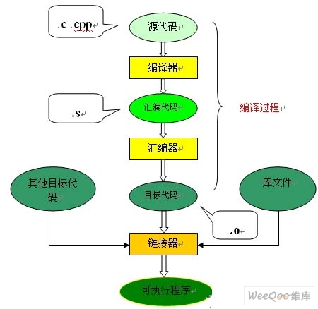

<link rel="stylesheet" href="http://ssh.cnsworder.com/styles/monokai_sublime.css" />
<script type="text/javascript" src="http://ssh.cnsworder.com/highlight.pack.js"></script>
<script type="text/javascript">
    hljs.initHighlightingOnLoad();
</script>


GNU/Linux Developer
==============================================================  

**Aplha2**  
**kernel stable： 3.13**  
**QQ群号： 20506135**  
**微信号： linux_developer**  
**本期编辑： 猫猫**  
**专题作者： onwone**  

《GNU/Linux Developer》第Aplha3期在春节后和大家见面了，本期**onwone**有**《C/C++编译系统》**、**《web.py分析(一)》**两个专题和大家分享。     

前言
====

工作了有N多年了，在GIS圈(其实关注于3D)转了又转5年了，但是有点忙忙碌碌，但是又不知道忙了些什么，至今无房无车。于是甚为消极。2013年于是决定好好的工作，挣钱。现在也为了提高自己，将自己知道的一些东西分享给大家。   

**《C/C++编译系统》**来源于，曾经的一个开源项目。原本是Mac项目，在移植的时候，没有使用Makefile这种方式，为了能在Linux上运行，特地的写了一个Makefile，来在linux上编译这个软件。两周的时间，每天从7点到9点，编写和调试Makefile。那个时候大概把《我一起写Makefile》翻了一遍，写了一个简单的Makefile。之后想用automake来编译，但是我失败了，从网上看到的教程实在是让我沮丧，看不懂。(rpmbuild也是给我这种感觉)。后来接触了CMake，这是一个非常简明的构建系统，非常直观了当的指令集合，完美的跨平台表现，让CMake别越来越多的软件只用它作为构建系统。  

**《web.py分析(一)》**这个专题是喜欢Python并且学习了它之后，用了web.py练了一次手，目前这个公司使用了python在很多项目上边，在工作之余分析了web.py。选择web.py比较简单，因为web.py非常简单（追踪代码时候发现了它不简单），代码来那个很少。相对于其他的python webserver。它是一个代码量和功能比例很大的webserver。这也满足了我想看apache，但是被它庞大代码量吓退的小心思。当然我希望以后，我还会写出它的后续**《web.py分析(二)》**、**《web.py分析(三)》**...

专题一  C/C++编译系统
====================

想好了写这个专题《C/C++编译系统》，但是心里还是有点忐忑，怕其中有认识不足的地方，或者错误误导大家。
在这里，我也讲不出来很牛本的东西，我这里讲述关于编译C/C++的问题和现在使用的自动化工具。   
**注意**：我们这里不牵涉C/C++的语法、逻辑造成的编译问题。

什么是Makefile
----------------

Makefile是一个或者多个C/C++工程的编译过程的描述。描述了从源文件到中间文件再到目标文件的过程。这些描述根据特定的规则编写，提供给make程序使用。make执行Makefile(默认名字是Makefile，如果是其他名字softname.mak，则执行命令-f softname.mak)，就执行了C/C++的编译过程。    
如果你在Linux上做过从源码安装软件，总会使用命令make & make install。不管之前的操作时./configure还是cmake。因为Makefile的简单明确，已经让它被广大程序员接受，作为了C/C++工具链必备的一环。新的编译系统的产生也只是为了辅助产生Makefile，而更好的服务程序员们。     

IDE和Makefile
---------------

对于使用IDE的伙计们，编程是一个简单的事情。编写代码，点击编译按钮。在规定的目录下，就会生成二进制文件。So easy。是的！为什么还需要使用Makefile这个东西。虽然不算很难写，但是比起点击一个按钮那也是负担啊！对于理由，我也只能说，可能你用不到，了解一下我们的工具总不是一件坏事。    
但是对于另一些人，他们必须要跟Makefile打交道了，比如持续集成的工程师们，为了定时发布而是用持续集成工具的工程师们，他们工具的限制要求了必须要写下编译脚本。以方便发布软件产品。   
再比如Linux kernel的开发工程师。    
对不起，这个时候没有IDE可以让他们使用。
木办法，写Makefile或者使用automake类似的工具生成Makefile吧。

C/C++的编译过程和Makefile
--------------------------

对于C/C++的编译的过程可以分成很多细节。
可以看图  



真实的情况只是很简单的场景，我们不是在汇编课上，需要使用gcc生成汇编语言来完成我们的作业。 

1. 编译  这个步骤是把\*.c和\*.h编译成*.o    
2. 打包或者链接  把头一个步骤的产生的\*.o打包成libxx.a（或者lib\*.so）  

如果是链接的话，产生可执行二进制文件 

这就是工程C/C++编译的两大步骤。也是我们实际可以看到的过程。在VS或者其他IDE比如Dev C++，编译过后，可以找到中间文件\*.o(\*.obj)和库文件（可执行文件）。      

Makefile就是对这个过程的描述。Makefile如何编写，我现在用一个例子说明。工程checknow，包含check和now两个项目。   

check项目，包含check1.c，check1.h和check2.h，check2.c四个文件，目标是生成libcheck.a

now项目，包含now1.c，now1.h和now2.h，now2.c四个文件，目标是生成libnow.a

我们会编写如下

``` makefile

    #compile configuration    
    CC=gcc   
    DEBUG=-g3   
    WARN=-Wall -Wshadow -Wpointer-arith -Wmissing-declarations -Wnested-externs    
    ifeq ($(shell uname), SunOS)    
        PLATOPTS+=-lsocket -lnsl    
    endif    
    CFLAGS+=$(DEBUG) $(OPTIMIZATION) $(WARN) $(OPTIONS) $(PLATOPTS)     
    LIBS=libcheck.a     
    LIBS+=libnow.a    
    CHECK_OBJS=check1.o check2.o    
    NOW_OBJS=now1.o now2.o

    all: $(LIBS)

    libcheck.a: $(CHECK_OBJS)    
        ar rcs libcheck.a $(CHECK_OBJS)    

    libnow.a: $(NOW_OBJS)    
        ar rcs libnow.a $(NOW_OBJS)    

    check1.o:check1.c check1.h    
        $(CC) -c check1.c check1.h -o check1.o $(CFLAGS) $(PLATOPTS)    
    check2.o:check2.h check2.c    
        $(CC) -c check2.h check2.c -o check2.o $(CFLAGS) $(PLATOPTS)       
    now1.o: now1.c now1.h    
        $(CC) -c now1.c now1.h -o now1.o $(CFLAGS) $(PLATOPTS)    
    now2.o: now2.h now2.c    
        $(CC) -c now2.h now2.c -o now2.o $(CFLAGS) $(PLATOPTS)    

    clean:
	    rm -rf $(LIBS) $(CHECK_OBJS) $(NOW_OBJS)
```

这就是我写的第一个Makefile，看到上边最多的就是依赖关系，而根据依赖关系进行编译。这就是Makefile最原本的意义，非常的清楚明白。远比已发布软件的Makefile更加的清楚明白。   

这个脚本完成了对编译的所有的全部，甚至包括扩平台的一些设置，可以使用简单的Shell命令。是一个完备的Makefile。        

但是懒惰的程序员通过定义了各种符号的含义，简化了Makefile编写的内容，上述脚本可以写成如下

``` makefile

    #compile configuration    
    CC=gcc   
    DEBUG=-g3   
    WARN=-Wall -Wshadow -Wpointer-arith -Wmissing-declarations -Wnested-externs    
    ifeq ($(shell uname), SunOS)    
        PLATOPTS+=-lsocket -lnsl    
    endif    
    CFLAGS+=$(DEBUG) $(OPTIMIZATION) $(WARN) $(OPTIONS) $(PLATOPTS)     
    LIBS=libcheck.a     
    LIBS+=libnow.a    
    CHECK_OBJS=check1.o check2.o    
    NOW_OBJS=now1.o now2.o

    all: $(LIBS)

    libcheck.a: $(CHECK_OBJS)    
        ar rcs libcheck.a $(CHECK_OBJS)    

    libnow.a: $(NOW_OBJS)    
        ar rcs libnow.a $(NOW_OBJS)    

    .c.o:  
        $(CC) -o $@ -c $<   

    clean:
	    rm -rf $(LIBS) $(CHECK_OBJS) $(NOW_OBJS)
```

最主要的简化，就是.c.o，同名替换，把.c后缀改成了.o，作为输出文件。   

> “$@”表示目标的集合，就像一个数组，“$@”依次取出目标，并执于命令。    
> “$<”表示所有的依赖目标集    

具体的内容，可以查看陈皓的[《跟我一些Makefile》](http://wiki.ubuntu.org.cn/%E8%B7%9F%E6%88%91%E4%B8%80%E8%B5%B7%E5%86%99Makefile)。

Makefile和CMake
----------------

我们已经了解Makefile，怎么去写Makefile。而Makefile有一个重大的缺陷，Makefile也要维护，而程序员是懒惰的。为了更好的维护Makefile，程序员们用不同的方法简化Makefile的维护，降低编译的难度。    

automake是\*nix上原生的生成makefile的工具。但是可惜automake怪异的使用方法，阻止了我使用它，当时我宁愿写Makefile，所以我不会使用automake，你有兴趣的话可以自己研究一下。(在一个开源工程中，我的确是些了Makefile，而没有使用automake)    
CMake的作用是生成Makefile或者特定的IDE工程，它极大解决编译源码的跨平台问题。原来越多的软件使用CMake作为构建系统。Qt，OSG，OGRE, opencv。强大的CMake可以使他们非常轻易的在Mac，\*nix，windows上进行编译。以前我不知道，但是在windows上，我编译过完整的Qt，OSG，OGRE，非常简单，点点按钮的事情（一般编译教程，重点在于解决你的库依赖）。 

上边Makefile的例子，使用CMake简直太简单了。定义输入，输出，设置一些环境变量就可以了，甚至不用设置环境变量。

``` cmake

    project(checknow)    
    cmake_minimum_required(VERSION 2.6)    
    # None    
    set(CMAKE_C_FLAGS "-Wall -Wshadow -Wpointer-arith -Wmissing-declarations -Wnested-externs")    
    # Debug     
    set(CMAKE_C_FLAGS_DEBUG "-g")    
    # Release    
    set(CMAKE_C_FLAGS_RELEASE "-O2 -DNDEBUG")    
    ADD_LIBRARY(chech check1.c check2.c )    
    ADD_LIBRARY(now now1.c now2.c )    
```

好了这就是CMake需要的脚本`CMakeLists.txt`，放在程序的源文件同级目录。是不是非常简单。

### cmake命令行

**两种使用方式**：
>    cmake [option] <path-to-source> 指向含有顶级CMakeLists.txt的那个目录  
>    cmake [option] <path-to-existing-build> 指向含有CMakeCache.txt的那个目录  


第一种方式用于第一次生成cmake makefile，此后可以在build dir里直接`cmake . `。**注意**`.`表示当前目录，因为当前目录中已经有CMakeCache.txt，所以适用第二种方式。实际上cmake总是先检查指定的build dir中有没有CMakeCache.txt，如果有就按第二种方式处理；如果没有才寻找CMakeLists.txt使用第一种方式处理。

**参数**  
>    -G <generator-name> 指定makefile生成器的名字     
>    -U globbing_expr 删除CMakeCache.txt中的变量     
>    -D var:type=value 添加变量及值到CMakeCache.txt中。注意-D后面不能有空格      

当然CMake为了简单的处理编译，定义了全部的指令。这里只用了非常简单的几种，如果你要深入的理解CMake编译系统，请查看CMake的官方文档和OSG，Qt里边CMakeLists.txt的内容。当然他们非常的易懂。    

好吧本篇专题就这样结束了，我在这里好像讲了很多，又好像什么都没有讲。只是为大家介绍了C/C++现在比较好的编译系统make，CMake。如果你有这样的需要，请根据你的需要来选择。

专题二  web.py分析(一)    
======================

在切入正题之前，我先表扬一下Python，我认为Python是一项伟大的语言（不要挑我毛病，我就是只用CPython），因为和C/C++语言的关系，它可以实现各个层面工作。而在混合编程的趋势下，和C/C++的紧密联系，又让它成为了互联网应用实现、大型软件的二次开发的神兵利器。    
对我来说它的伟大之处在简洁，简单。非常简短的语句可以实现强大的功能。大量的C/C++代码才能够完成的软件，在Python中减少一多半量完成，这对我们学习是一个如此的有利条件。我真的爱死它了。(这个时候请不要给我提GIL)

我讲述的内容是webpy的解析。为什么是一呢？因为webpy运行作为http server的基本功能(接收连接请求，生成页面，输出)，不仅仅是这一点的粗略功能，还有更加细节的内容,render系统，session管理的内容。而我在这里仅仅是把它作为http server的运行情况给提炼了出来。之后我会把render，session也仔细分析一下。

(题外话：曾经觉得写出来一个http server是一个牛叉至极的事情，Apache的httpd多大啊。编译出来2M的二进制文件，C代码得有多少啊。之前有点小恐惧)

webpy使用到得基本技术
--------------------
  
如果你也要拆解一下webpy，你需要重点注意一下Python的几个技术 

### 1. closure(闭包)
``` python

    def maker(N):
        def action(x):
            return x * N
        print(action.func_closure) # 打印出action函数的func_closure属性值
        return action

    N = 10
    print('int N: id = %#0x, val = %d' % (id(N), N)) # N的值为10（整数10的地址是0x8e82044)  
```
> int N: id = 0x8e82044, val = 10   

``` python
    mul10 = maker(N) # action.func_closure中含有整数10（即自由变量N）(<cell at 0x90e96bc: int object at 0x8e82044>,)  
```
闭包的这种 能够记住环境状态 的特性非常有用，Python中有一些其他特性就是借助闭包来实现的，比如 装饰器。  

### 2. Python的内置方法的意义  
web.py里边有太多使用python内置方法，重载方法的例子。通过猜，Google（bing）也能比较清楚的明白这些方法的作用。    
  比如getattr方法，可以通过这个方法实现调用    
``` python

    import sys
    
    path = getattr(sys, "path")
    print( path)
```

  实现了sys.path()的调用，在这里sys.path等于getattr(sys, "path")    
  
  hasattr方法，可以类是否有某个对象    
``` python

    hasattr(sys, 'path')
````    

>    True


### 3. 面向对象    
    python本身就是面向对象的语言，web.py使用面向对象的本来就是水到渠成的，在追踪代码时候，如果方法并没有在这个类里边，请考虑它的父类实现有这样的方法。

web.py解析(httpserver部分)

**web.py例子**
``` python
    import web

    urls = ("/.*", "hello")
    app = web.application(urls, globals())

    class hello:
        def GET(self):
            return 'Hello, world!'

    if __name__ == "__main__":
        print('app run!!!!')
        app.run()
```

从这个例子入手。这里构建了url映射表，并用映射表在构造了application，之后pplication只执行了一个run方法。    
1. application对象`__init__`时候，将映射表，环境传入application，创建运行环境，创建了processors。`application.run`调用`wsgi.runwsgi(self.wsgifunc(\*middleware))`
将application的方法wsgifunc最为闭包传递给后边的方法，之后的方法，但是在这里我要告诉大家这个方法就是server进行response的地方。    
2. wsgi.runwsgi经过条件判断，把wsgifunc交给了httpserver.runsimple(func, validip(listget(sys.argv, 1, '')))，在这里listget把命令行的参数ip和port。    
3. `httpserver.runsimple(func，(ip, port))`方法。    
    1. StaticMiddleware里边对func进行了分拣，如果属于static文件（通过文件夹名称划分），就是归于StaticMiddleware把文件输出。    
    2. 此时原来的func替换成了StaticMiddleware的`__call__`。之后的LogMiddleware，在func包裹了一层日志输出。    
    3. 终于到了`WSGIServer`，`WSGIServer`也很简单，只有一点方法`wsgiserver.CherryPyWSGIServer(server\_address, wsgi\_app, server_name)`。    
4. `wsgiserver.CherryPyWSGIServer`，创建了线程池ThreadPool，`WSGIGateway_10`和`httpserver`的各项参数，如端口，接收请求的根数，超时时间等。    
5. 这里结束了wsgiserver.CherryPyWSGIServer，回到WSGIServer方法，再回到httpserver.runsimple，到了server.start()    
6. server.start()正式开始创建了socket，并开始监听。启动了线程池（requests.start()），把线程池装满线程。开始接受连接，对连接的socket进行封装成connection。把connection放入连接池。
与此同时线程池中的线程也在工作着，从连接池拿到连接，然后调用conn.communication  7. communication方法的作用，创建HTTPRequest，分析`request`，`req.response`.    
    1. 分析request,读取了http header，获取了http所需的一切内容。    
    2. req.response，最重要的部分self.server.gateway(self).respond()，在这里gateway进行了构造，其中最重要的是整个http环境进行了记录。由gateway进行response。    
8. 而在WSGIGateway，respond里边可以看到这个`self.req.server.wsgi_app(self.env, self.start_response)`这样一句，
这个`wsgi_app`就是第4步，`wsgi_app`就是在这一步返回的闭包。那个报过了日志输出的func。而核心还是application的wsgifunc。终于绕回来了。    
9. 在application的wsgi里边，`load(env)`将环境进行载入，将一开始add processor的几个processors，执行完了之后，执行handle()方法。
在handle里边，_match确定了需要调用那个类，`_delegate`真正执行了对应path的类。     

诶, 一层一层的追溯代码的调用关系，中间经历了几次连接断掉的情况。好几次都绕在了，request的respond方法如何到了application.wsgifunc。http状态是如何到了application里边的，而urls mapping只在application里边。这个像是断掉的绳子，连接不起了。    

httpserver的实质是一个socket监听端口，分析http head，根据http head的method，path，paramters，然后输出文本。就是这么简单，但是web.py为了实现这个非常简单的内容。绕了多少圈啊！！！我认为web.py将application作为网站内容的container不太合适，也许这就是web.py代码绕来绕去的原因。


web.py结构发展预感
--------------------

web.py的httpserver有一个比较凌乱的调用过程，是在太多凌乱了。太多的使用了闭包，有些闭包的实际的调用时机，实际上比你看到的时机要晚非常多，wsgifunc是一个非常重要而且讨厌的例子。
在wsgiserver模块里的`__init__.py`可以看到WSGIPathInfoDispatcher，内容非常简单。实现了application类中_match的作用，而且也使得减少使用了闭包。对于代码难度也有所降低。
当然只是我发现的一小点内容，web.py也在尽量简化它的代码逻辑。这也是为了web.py以后发展。不用这么多闭包和奇葩的回调。分析起来很艰难啊。

分析web.py的感受    
-----------------

我在分析web.py只是最为httpserver来分析的，当然也只是分析了它如何实现httpserver。但是我也看到了它在使用ssl，chunkTransfer等等一些http服务器应用的代码。web.py一个优秀的httpserver，在这里我只是分析它的实现逻辑，但是对它更加细节部分缺少理解，也对他如何将这些细节组合在一起也缺少理解。    
我想以后我还会更加深入的分析web.py这款简单的httpserver。

**NOTE：**    
开始时候想到了一个问题。web.py怎么能把全局变量和线程池搅合在一起，而没有出现错误。纠结了一天，第二天醒了的时候，想起来一个非常
web.py使用了线程池，application内部使用了web.ctx作为全局变量。但事实上，但是web.ctx是ThreadedDict，最终来自于threadlocal,如果你想了解threadlocal是怎么实现的，查看python23.py。

资源推荐
----------

一段代码
--------
```  
code here
```

Tip
-------
#### 开发

#### 运维


#### 使用


作者简介
--------
<a name="tj"></a>
  
网名： onwone  
群ID: [北京]Num1*  
微博：<>  
技术： 
简介：  
- - -
欢迎群成员自荐自己的blog文章和收集的资源，发[邮件](mailto:cnsworder@gmail.com)给我，如果有意见或建议都可以mail我。  
如果无法直接在邮件内查看，请访问[github上的页面](https://github.com/cnsworder/publication/blob/master/alpha2.md)或[网站](http://ssh.cnsworder.com/alpha2.html)。  
我们在github上开放编辑希望大家能参与到其中。
