<link rel="stylesheet" href="http://docs.cnsworder.com/styles/monokai_sublime.css" />
<script type="text/javascript" src="http://docs.cnsworder.com/highlight.pack.js"></script>
<script type="text/javascript">
    hljs.initHighlightingOnLoad();
</script>

GNU/Linux Developer
==============================================================  

**Version: Aplha6**  
**QQ群号： 20506135**  
**微信号： linux_developer**  
**主编: 猫猫**  

《GNU/Linux Developer》第**Aplha6**期和大家见面了，本期 *我们* 将会给大家带来 `git` 的相关专题。  

git简介
--------------------------------------------
**作者: 唯一**

###1. git的概念

Git是一个分布式版本控制／软件配置管理软件，原是Linux内核开发者林纳斯·托瓦兹（Linus Torvalds）为更好地管理Linux内核开发而设计。应注意的是，这与GNU Interactive Tools（一个类似Norton Commander界面的文件管理器）有所不同。

林纳斯·托瓦兹自嘲地取了这个名字“git”，读音为英语发音：/ɡ?t/，在英国俚语中指一个愚笨或者不开心的人。

Git最初的开发动力来自于BitKeeper和Monotone。Git最初只是作为一个可以被其他前端（比如Cogito或StGIT）包装的后端而开发的，但后来Git内核已经成熟到可以独立地用作版本控制。很多著名的软件都使用Git进行版本控制，其中包括Linux内核、X.Org服务器和OLPC内核等项目的开发流程。

###2. git的历史

早期Linux的开发人员是使用BitKeeper来管理版本控制和维护代码。2005年的时候，开发BitKeeper的公司同Linux内核开源社区退出合作关系，并收回使用BitKeeper的权利。Torvalds开始着手开发Git来替代BitKeeper。

###3. git的主要功能

Git是用于Linux内核开发的版本控制工具。与CVS、Subversion一类的集中式版本控制工具不同，它采用了分布式版本库的作法，不需要服务器端软件，就可以运作版本控制，使得源代码的发布和交流极其方便。Git的速度很快，这对于诸如Linux内核这样的大项目来说自然很重要。Git最为出色的是它的合并追踪（merge tracing）能力。

实际上内核开发团队决定开始开发和使用Git来作为内核开发的版本控制系统的时候，世界上开源社区的反对声音不少，最大的理由是Git太艰涩难懂，从Git的内部工作机制来说，的确是这样。但是随着开发的深入，Git的正常使用都由一些友善的命令稿来执行，使Git变得非常好用。现在，越来越多的著名项目采用Git来管理项目开发，例如：wine、U-boot。

作为开源自由原教旨主义项目，Git没有对版本库的浏览和修改做任何的权限限制，通过其他工具也可以达到有限的权限控制，比如：gitosis、CodeBeamer MR。原本Git的使用范围只适用于Linux/Unix平台，但在Windows平台下的使用也日渐成熟，这主要归功于Cygwin、msysgit环境，以及TortoiseGit这样易用的GUI工具。Git的源代码中也已经加入了对Cygwin与MinGW编译环境的支持且逐渐完善，为Windows用户带来福音。

###4. git与其他版本控制的异同，优势在哪里

Git和其他版本控制系统（如CVS）有不少的差别，Git本身关心文件的整体性是否有改变，但多数的CVS或Subversion系统则在乎文件内容的差异。因此Git更像一个文件系统，直接在本机上取得数据，不必连接到主机端获取数据。

如果你能理解这个概念，那么你就已经上手一半了。需要做一点声明，GIT并不是目前第一个或唯一的分布式版本控制系统。还有一些系统，例如Bitkeeper, Mercurial等，也是运行在分布式模式上的。但GIT在这方面做的更好，而且有更多强大的功能特征。

GIT跟SVN一样有自己的集中式版本库或服务器。但，GIT更倾向于被使用于分布式模式，也就是每个开发人员从中心版本库/服务器上chect out代码后会在自己的机器上克隆一个自己的版本库。可以这样说，如果你被困在一个不能连接网络的地方时，就像在飞机上，地下室，电梯里等，你仍然能够提 交文件，查看历史版本记录，创建项目分支，等。对一些人来说，这好像没多大用处，但当你突然遇到没有网络的环境时，这个将解决你的大麻烦。

同样，这种分布式的操作模式对于开源软件社区的开发来说也是个巨大的恩赐，你不必再像以前那样做出补丁包，通过email方式发送出去，你只需要创建一个分支，向项目团队发送一个推请求。这能让你的代码保持最新，而且不会在传输过程中丢失。GitHub.com就是一个这样的优秀案例。

P.S. by 猫猫：

> 其实，说起来，Git应该相对svn等等，更适合我这样的没有固定工作的coder使用。因为我这样的人可以带着笔记本，在任何可以想象到的地方搬砖，但是这些地方真心的不一定有网络的


快速使用git环境
-------------------------------
**作者: 江湖郎中**

如果你有其他scm的工具的使用经验，git的上手很简单！

我这里用三分钟的时间让大家上手git～～～

### 初始化git

``` bash
git init --bare
```

### 下载远端代码

``` bash
git clone http://github.com/cnsworder/publication.git
```


### 提交代码到本地仓库

``` bash
git add <files>
git commit -m "message"
```

### 拉取远端代码

``` bash
git pull origin master
```

### 推送到远端

``` bash
git push origin master
```

### 切换分支

``` bash
git checkout <branch_name>
```

### 合并分支

``` bash
git merge <branch_name>
```

OK, 现在你已经可以上手git了。


使用 git 进行项目管理
--------------------------------------------
**作者: 江湖郎中**

git仅仅是一个分布式版本管理系统，但是它却改进的却不仅仅是版本管理的由中央仓库转换成了分布式。

传统的svn管理方式由于采用整体复制的方式来生成branch和tag，所以成本太高。所以只有在重要阶段才会去使用branch和tag。
而git object模型在生成branch和git是成本却很小，branch成为了常态，合并与快速冲突成了必然。
如果我们以敏捷开发的观点来看这个问题，git的模型更加适合敏捷的快速响应的问题。

使用git进行管理最佳的实践模型有很多，而git flow是最著名的一个。

### git flow


我们看图说话。

主干是master和developer分支，所有的代码以这两个分支为基准。

其他功能性分支

+ feature分支进行新功能开发;
+ hotfix分支进行bug修复
+ release分支进行发布

git-flow这个工具可以帮助你完成这个过程。`git flow`命令帮可以你完成分支构建与合并的一系列的工作。

使用方法：

```
git flow <command> start [OPT]
git flow <command> finish [OPT]
```

你的使用过程如下：


### 使用git来完成敏捷开发的闭环

敏捷的实践的问题一直很困扰我，我一方面认为敏捷是一个好的实践模型，但是却偏偏在实际工作过程中不断的发现敏捷不能够真正的达到目标，甚至连传统的管理效果都无法达到。

在实践中往往敏捷缺少某一个或几个工具而无法实现闭环，导致敏捷的效率并不 `敏捷` 。

在实践过程中发现借助git可以很好的完成这个闭环，并使用 `git` 来穿插整个敏捷过程或者穿插到现有的过程模型中。

`git`在过程管理中成为推动敏捷的工作流程的引擎。借助 `git` 的push动作自动化触发构建流程，走差流程，测试流程，发布流程。

微观方面的`快速冲突`、`及时响应` 和 `结对编程` 等过程在 `git` 的分支和并模型上能够达到很好的吻合。


### 个人对git flow的实践的改进
gitflow虽好，但不是万能的，且有很多的局限性能，并且如果希望穿插进现有的流程就需要我们做一些自己的研究了。

#### 个人工作分支

每个人在本地工作状态的保存有时会出现一些问题，比如，你需要在两个机器上进行开发，你需要跨平台工作。

本地工作的版本库需要挂载分区来工作，或者需要远程连接你的另一台工作主机来fetch你的代码。这样可以达到目的，但是总不是那么顺畅。

而将工作分支同步的到中央仓库，带来了一个便捷性，和管理的统一性。

#### 添加测试、自动构建、自动部署分支

在发布前的测试环境，gitflow模型并没有提及，而在管理流程中测试往往很重要，并且是过程管理中的重要环节。而自动构建是自动化测试的前提。

+ 在 `git push` 时通过hook直接触发构建流程，并在构建结束后触发自动化测试。
+ 在成员 `git push` 后，测试人员pull代码进行测试。 

当你将代码push到中央仓库的release分支时，触发的自动构建流程相应的结束后被自动化工具push到响应的服务器。


### 文本化过程数据

版本管理工具对非文本化的版本管理能力很弱完全可以忽略不计，甚至于无法达到你通过修改非文本文档的命名的最原始的方式的效率。

通过一系列的工具将传统的pdf、ppt等使用markdown，rest等语法以源码方式管理，在需要的时候借助工具编译并发布出来。

### git走查代码

通过强制的限制可以在代码通过审核之前不能进入主干分支。你可以使用git

而达到每一行都能查找到对应的提交说明的方式，在走差过程中成为了有效的利器。由 `git blame` 查看响应行的提交HASH，由`git log HASH`来查看提交记录，从而使走查跟踪变得有效。


### 开源社区使用git协作

github上对代码进行管理，review，通知;
邮件和irc进行即使交流;
trello上做任务管理;
google doc进行文档的协同编辑;
产品可以快速的发布到云服务平台上;
距离不是问题，问题是交流产生了问题。目前有很多的免费的小团队的协作工具，国内比较有名的是tower.im

git gui
---------------------------
**作者: 猫猫**

上个月在朋友的公司里看到了VSS，不由得想到了当年VSS和CVS双雄并立的峥嵘岁月——其实当时的第一反应是竟然还有人在用VSS。遥想当年的岁月，不由得唏嘘如今CVS已经很少有人提及了(VSS也是)。不过，从当年的CVS，到已经略显老态的SVN，再到如今如日中天的GIT，这一支的发展过程里却有一个历经多年却经久不衰的名字——Tortoise，无论流行的版本管理工具如何改变，这只神龟小强一直屹立在我们的电脑中。
从TortoiseCVS到TortoiseSVN再到TortoiseGIT一路走来，最大的好处莫过于操作习惯的延续。神龟的一路发展，无论内在的版本控制体系如何的改变，从普通文件加头也好，从集中管理到分布式管理也好，Tortoise系列的GUI工具很好的把操作风格和操作习惯延续了下来。

下面通过几张图片来说明TortoiseSVN和TortoiseGIT

#### 1. 在空目录中列出来的右键菜单


仅仅是因为Git中checkout变成了clone而已，其他部分很大程度的保持了一样。

#### 2. 在已经存在版本信息的目录中的右键菜单


#### 3. 已经存在版本控制信息的目录中的详细菜单

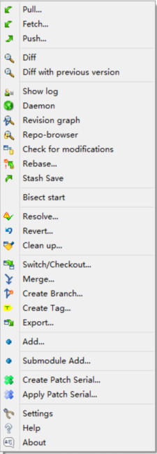

通过以上几张图的比较可以看出，虽然其实仔细看会发现工作原理和流程是完全不同的，但是同样的这个系列的工具延续使用下来，从TortoiseSVN换到TortoiseGit基本不会感到有任何的不适应。

### TortoiseGi的简单使用

#### 1. TortoiseGit使用前的设置

在使用TortoiseGit之前，需要设置msysgit的运行目录。其实，TortoiseGit应该仅仅是对GIT操作进行封装的一张皮，而GIT操作的在Windows下的核心部分是在msysgit这个工程里面实现的。也就是说，对应于linux中的git-core之类的东西，其实是在msysgit里面。

第一次使用TortoiseGit或者在TortoiseGit的Settings菜单中，可以找到设置msysgit可执行文件路径的地方

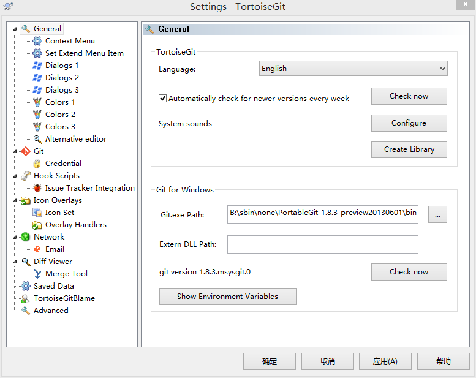

注意，设置这个路径是，一定要指向到msysgit的bin目录下，否则是无法找到正确的可执行文件的。设置好以后，可以点击Check now按钮，如果能如上图那样显示版本信息，即说明msysgit的可执行目录设置成功。

P.S. [msysgit的下载地址](http://msysgit.github.io/)

#### 2. 设置作者信息

第一次提交或者在TortoiseGit的Settings菜单中，可以找到对作者信息的设置，主要包括作者的名字和邮件地址。如果在提交是勾选了Set author复选框，那么就会将这里设置的作者名字自动添加进去。目前据猜测，这个名字和邮件地址应该不需要和在GIT服务器上注册时使用的用户名和邮件地址相同，简而言之，这个名字和邮件地址应该是可以随便写的。

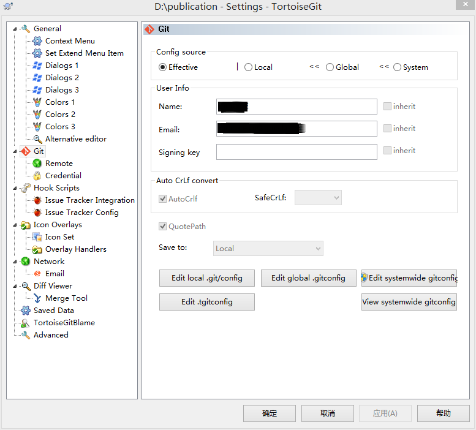

#### 3. 下载已经存在的仓库

在没有记录版本信息的目录中选在右键菜单中的Git Clone，会得到如下图的窗口

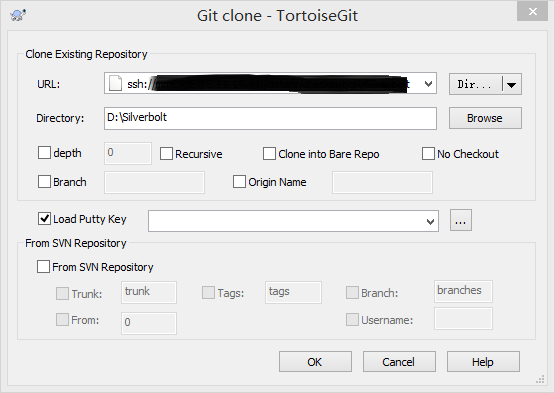

URL框中是要下载的仓库的地址，ssh只是其中的一种协议罢了，更高大上的会有https等其他协议。以后计划会专门有Git服务器的搭建系列，里面会对支持不同协议的服务器进行分别介绍，本文仅仅是对神龟GIT的简单使用的介绍，过多深入的内容就不涉及了。

Directory框中是仓库下载到本地的目录位置，这就不需要过多说明了。

另外一个比较重要的地方是Branch，选中这个复选框后，后面的输入框会变的可用。郎中的文章中已经对GIT的Branch的优点进行了介绍，这里就不在做过多的解释。在这个框中输入自己需要的Branch名字，就会下载对应的Branch的内容，比如Develop或者Fix之类。如果不勾选Branch复选框，通常默认情况下会下载master也就是主分支的内容。注意，主分支并不意味着是最新或者最好的分支，如果出现主分支中内容是空的，而仓库的最新内容都集中在Develop分支的情况也是可能出现的。

#### 4. 提交

这里的提交会出现一个类似TortoiseSVN的窗口，如图

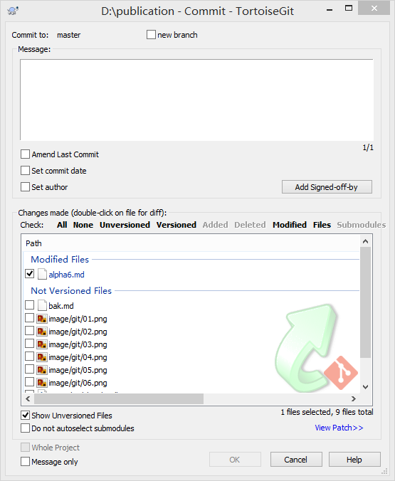

使用方法与TortoiseSVN基本相同，在Message框中输入本次提交的注释内容，文件列表中选再要提交更改的文件。

与TortoiseSVN最大的不同点在于，TortoiseGit中，如果不输入注释内容是无法提交的，而TortoiseSVN却可以提交空的注释。这样做的好处是，再也不用为了弄明白两个版本的不同点而花费大量的时间把代码都比较一遍了。当然，如果有杀千刀的乱写注释内容就神也没办法了。

还有一个不同点，Set commit date和Set author两个复选框，如果勾上的话会自动设置提交的时间和作者，这也算对TortoiseSVN中一个遗憾地弥补了。

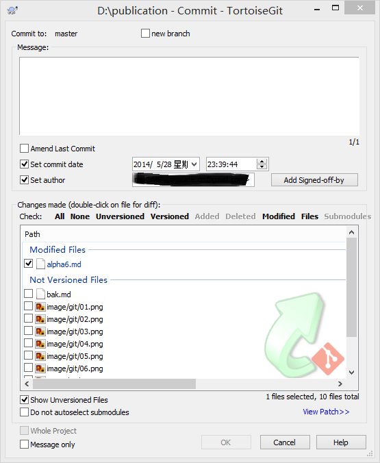

#### 5. 将更改的内容同步到GIT服务器

GIT是一个分布式的版本管理工具，也就是说除了GIT服务器自身作为一个集中管理的最高存在，在开发者的机器上，还会存在一个最高存在的分身。上面所说的提交，其实仅仅是更改的内容提交到了本地的服务器中，并不会对真正GIT服务器做任何的更改，除非……

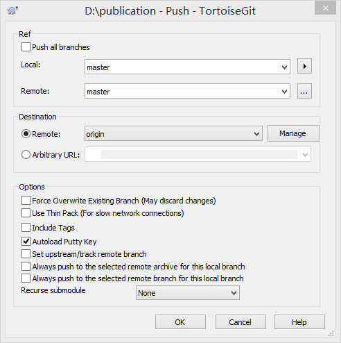

Push操作的时候，会自动匹配当前工作目录中的Branch把本地服务器中的更改同步到GIT服务器上的对应Branch中。例如上图中，就是将本地的master的更改提交到GIT服务器中的master分支。当然，Remote这里是可以改的。

这个窗口中的其他设置，英文略同的同学应该能够看懂，看不懂或者不想看的同学就请待下回分解了。

#### 6. 将GIT服务器中的最新内容更新到本地

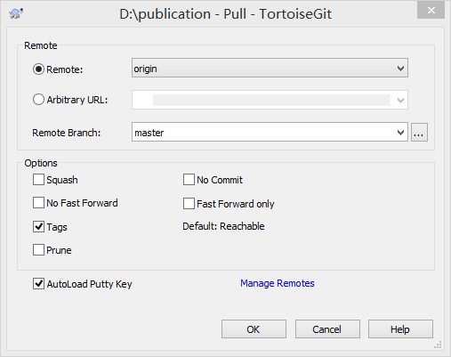

Pull很形象，与“推”相反的就是“拉”。

Pull的时候也会自动匹配工作目录中的Branch而选择GIT服务器中对应的Branch。与Push一样，Remote这里也是可以改的。

#### 7. 同步的一体化操作

留心观察的话，会发现在GIT的菜单中还有个Git Sync，其实这里是把一些常用的操作比如Push和Pull集合到了一起，如图

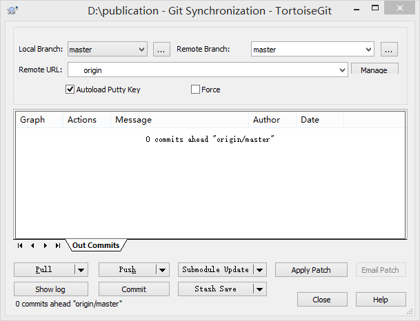

好吧，我会告诉你们我一点都不喜欢这个，我还是喜欢自己去Push或者Pull。

#### 8. 切换分支

既然前面说了分支在GIT体系中的重要性，那么切换分支就是无论再怎么简单的介绍都无法绕过的内容了。

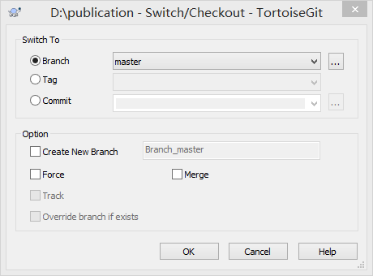

Switch/Checkout菜单，窗口中默认选中的就是Branch，在后面已经激活的列表中选择要切换到的分支即可。同理，下面的Tag和Commit两个单选也是一样的作用。

#### 9. Revert

取消本次的修改内容，将选中本地文件恢复到服务器中的最新版的状态。这个要谨慎使用，因为一旦Revert，本地所做的未提交的修改都会丢失。

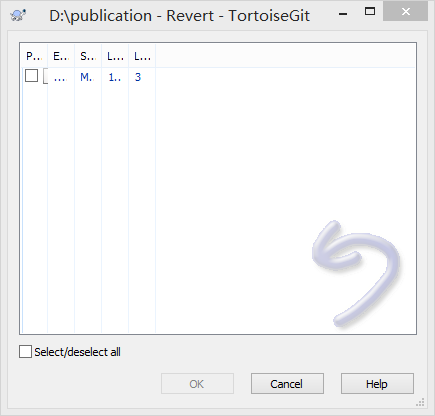

#### 10. Clean up

如果出现无法提交的情况，大多数情况下，Clean up都是可以解决的，大不了就是多组合几次选项试试呗。最后实在无法解决的话，还有大招——换个目录重新下载最新的然后人工合并……

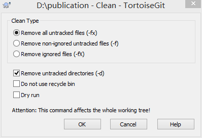

#### 11. Show log

显示更新的历史记录。

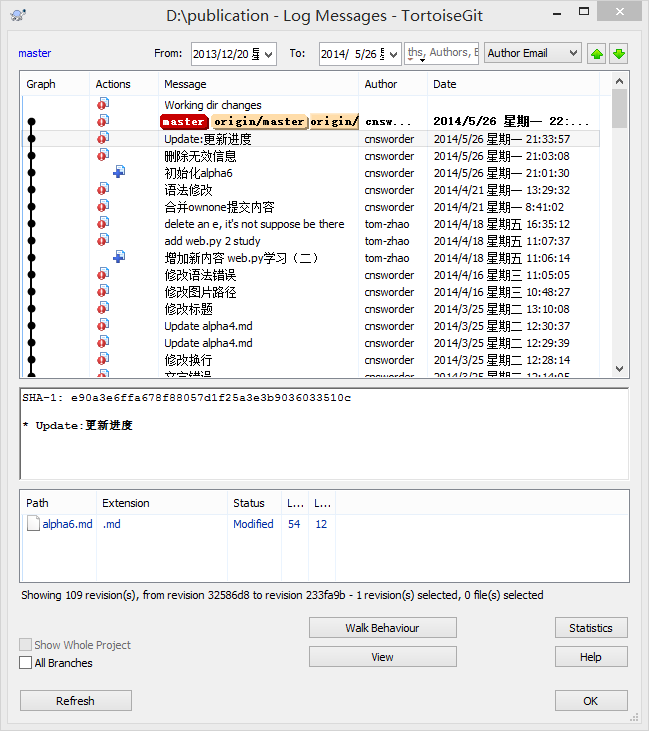

在列表中的某次更新上右键还会有更详细的菜单弹出的，详情且听下回分解。

#### 12. Repo-broswer

查看服务器的文件结构。这应该是目前为止，我觉得跟TortoiseSVN比较起来变化最大的一个部分了。不过转到GIT以后，似乎这个broswer用的相当的少了，为啥？

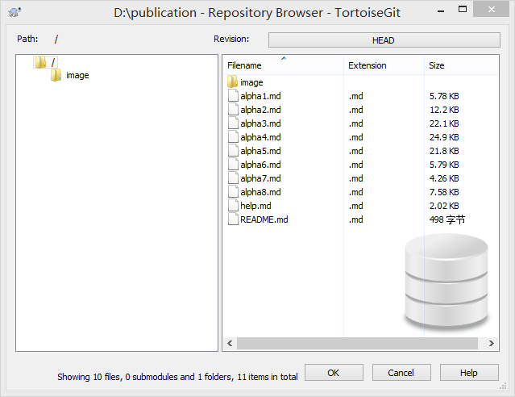

#### 13. Diff

比较不同。这样改是无论版本控制的理念如何变化，都会一贯继承下来的功能了。与TortoiseSVN一样，TortoiseGit可以选中单个文件进行Diff，也可以选中某个目录进行Diff。

如果选中文件进行Diff，会直接显示本地文件和服务器中的最新版的差异——如果有的话——顺便说一句，在Show log的列表中选择两个不同版本的文件也是可以通过Compare revisions对这两个版本进行比较的。

如果选择目录进行Diff，会列出本地的当前目录和服务器上对应目录的全部不同的文件

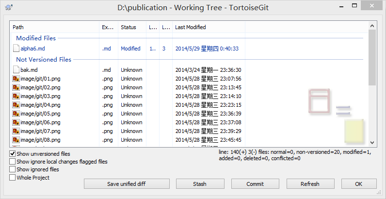

然后选择要查看的文件，右键中有Compare with base，可以实现和选中单个文件进行Diff一样的效果。

简单介绍如此了，继续写的话又会被唯一画圈圈诅咒了 ^.^

资源推荐
----------
本期推荐的是git客户端！

[sourcetree](http://www.sourcetreeapp.com/): atlassian出品的精品。

[smartgithg](http://www.syntevo.com/smartgithg/): 三平台通杀的git和Mercurial的客户端

[github](https://mac.github.com/): github的客户端，个人感觉不好用

`tig`: 纯文本的，个人正在使用，强烈推荐

`egg`: emacs的插件

`git.zip`: vim的插件

`egit`: eclipse的插件

一段代码
--------

``` python
#!env python2
#encoding=utf-8
"""
__init__.py 导出包内模块
"""
__all__ = ["module1", "module2"]
```

Tip
-------
#### 分支合并冲突

1. `git merge` 发生冲突
2. 修改，并`git add <file>;git commit -m "messge"`提交

#### 演合冲突

1. `git rebase master`发生冲突
2. 修改，并`git add <file>`
3. `git rebase --continue`继续演合


#### 本地有未提交的代码拉取远程代码

+ `git stash`
+ `git pull`
+ `git stash apply`


- - - -
欢迎群成员自荐自己的blog文章和收集的资源，发[邮件](mailto:cnsworder@gmail.com)给我，如果有意见或建议都可以mail我。  
如果无法直接在邮件内查看，请访问[github上的页面](https://github.com/cnsworder/publication/blob/master/alpha6.md)或[网站](http://docs.cnsworder.com)。  
我们在github上开放编辑希望大家能参与到其中。
